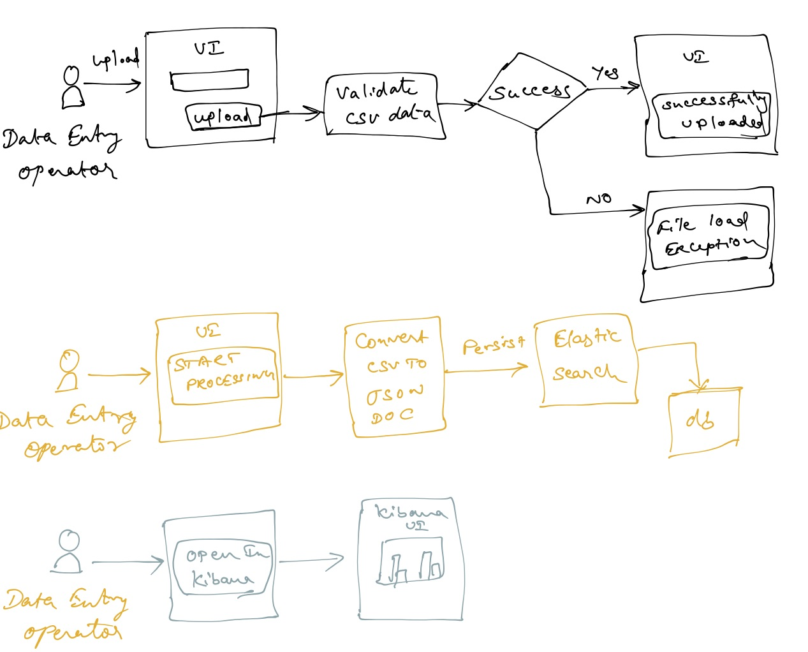
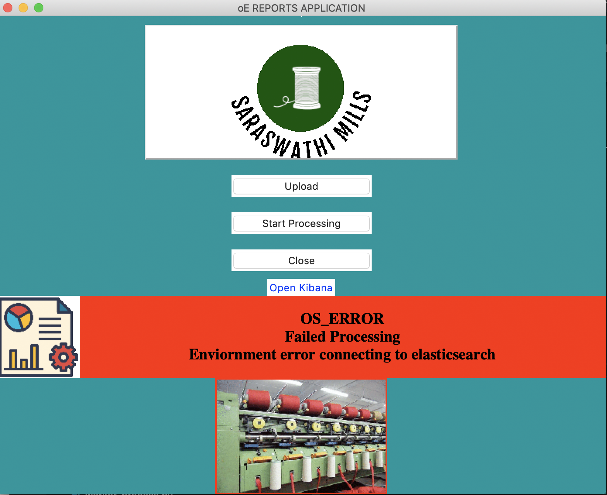
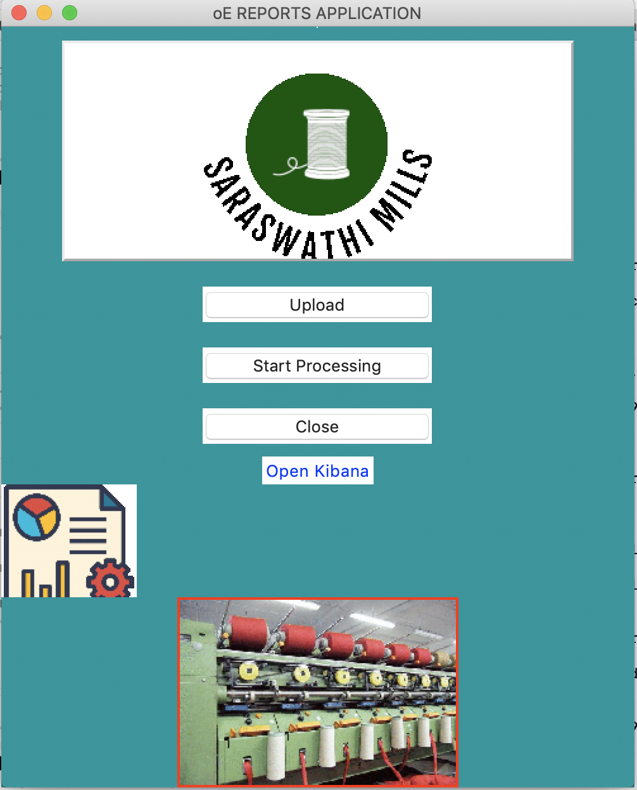
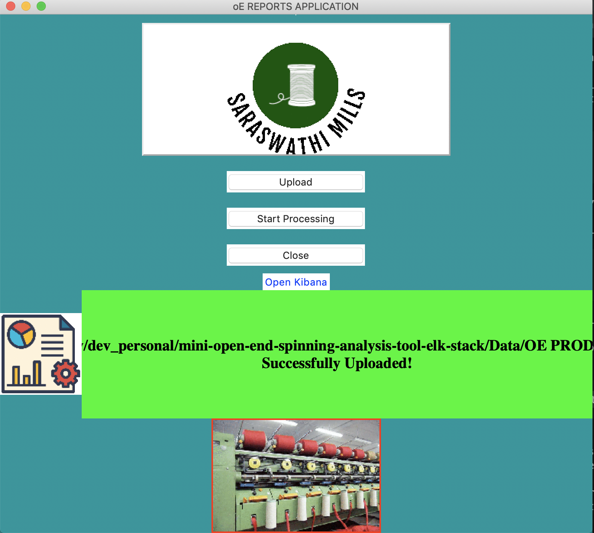
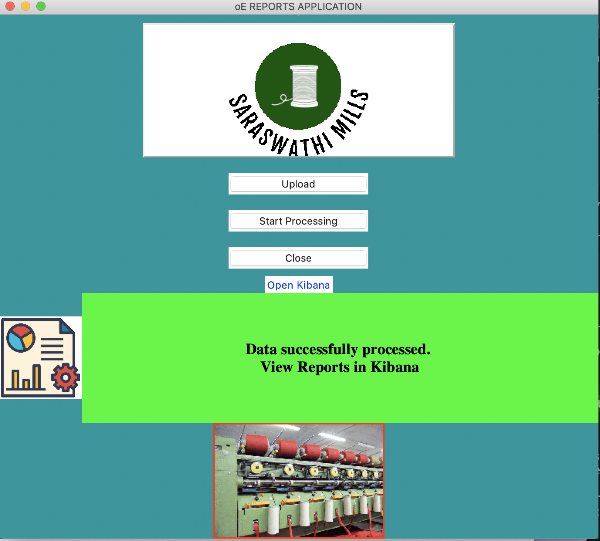

# Project Overview
Converts the spinning mill daily production data uploaded in csv file to JSON format and stores it in Elasticsearch for multiple report generation using Kibana.

Used ELK stack (Elastic Search and Kibana) to create a mini working application for
workers and machine data management in a spinning mill. Kibana provides multiple ways for business to dice and slice data as reports (and visulaization using graphs) to generate business intelligence.

## Phase 1 - Completed
First phase of this completed project uses existing daily excel reports as input to the system. The data in excel spreadsheet is converted to a normalized data in JSON format and the JSON document is stored in Elasticsearch. Kibana reads the JSON documents and provides visualization of data as graphs and reports.

## Phase 2 - To be started
Second phase of this project plan is to eliminate the excel format altogether. Plan is to build a Nodejs based Express UI application for data enrtry operator to key-in daily report directly. The data entered by operator will be stored in Elasticsearch for Kibana to display.

# Project Architecture



# Installation Steps For Mac
## Install Python3
```
>> brew instal python3
```
Application was built using python 3.7

## Install progressbar module
```
>> pip install progressbar
```
## Install elasticsearch
```
>> pip install elasticsearch
Installing collected packages: elasticsearch
Successfully installed elasticsearch-7.5.1
```
## Install pandas
```
>> pip3 install pandas
...
Successfully installed numpy-1.18.1 pandas-1.0.0 python-dateutil-2.8.1 pytz-2019.3 six-1.14.0
```
## Install yaml
```
>> pip3 install pyyaml
...
Successfully installed pyyaml-5.3
```
## Install xlrd
```
>>> pip3 install xlrd
```

## Start show button application

```
>>> python3 show_button.py
```

If you see error as below, it means elasticsearch server is not up and running.



## Start Elasticsearch server
  * Download and install elasticserach from internet using the tar file on Mac
  * Run elasticsearch from terminal as below:
    ```
    >> ./bin/elasticsearch
    ```
    This should run server at port 9200. Hit the server at 'http://localhost:9200' to verify.
  
  ## Start application again
    ```
    >>> python3 show_button.py
    ```
* Home page

    

* File uploaded page


* File Processed Page


## Install Kibana

```
>>brew tap elastic/tap
```

```
>> brew install elastic/tap/kibana-full
```

* Start Kibana server
```
>>> ~/Applications/homebrew/Cellar/kibana-full/7.5.2

...
[04:32:58.482] [info][listening] Server running at http://localhost:5601
  log   [04:32:58.505] [info][server][Kibana][http] http server running at http://localhost:5601
  ```

  This should open Kibana dashboard in your default webbrowser.

  ## Kibana data visualization

  * index data using oe_index
  * Configure x-axis and y-axis for type of graph you want to plot